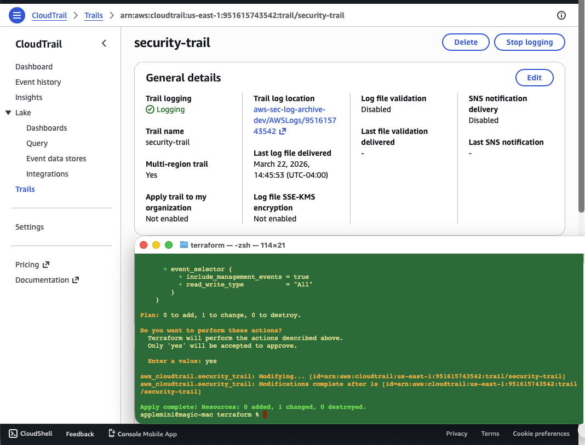
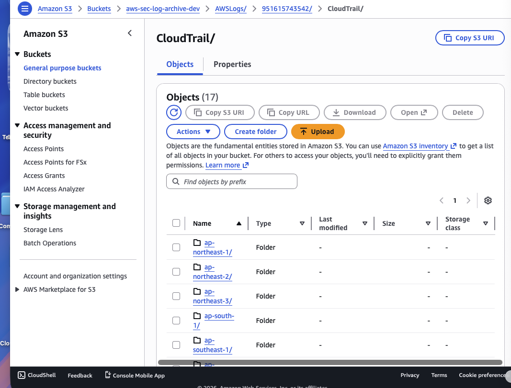
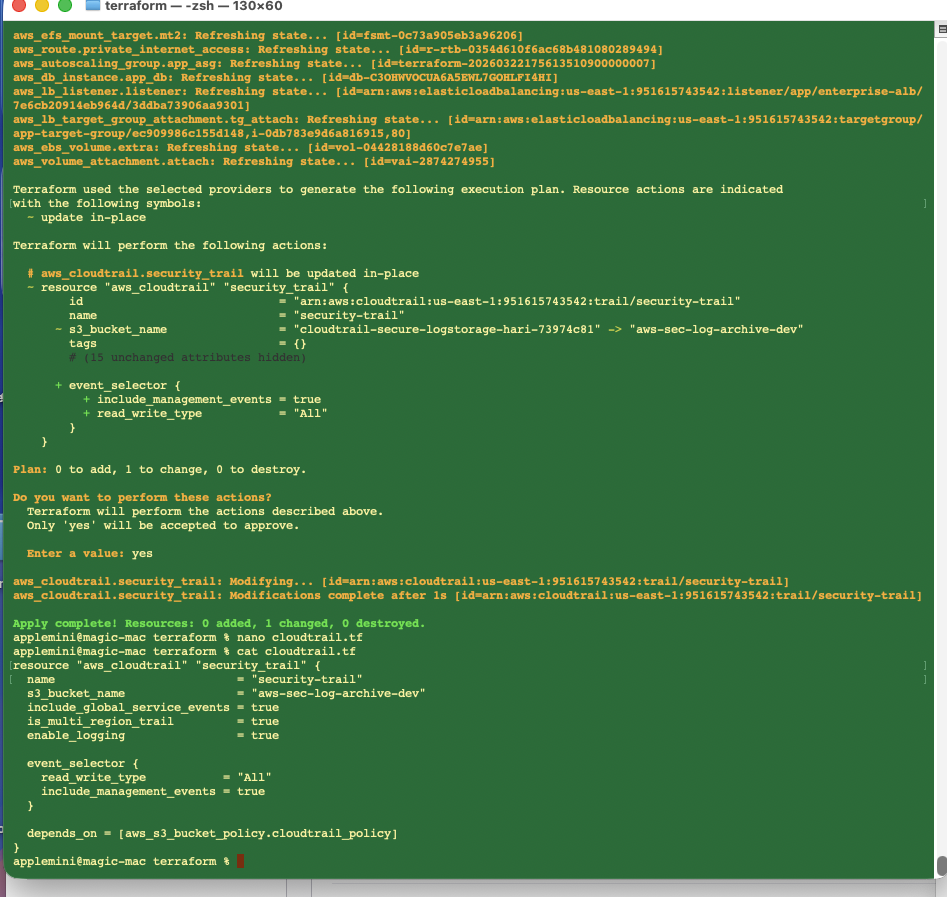
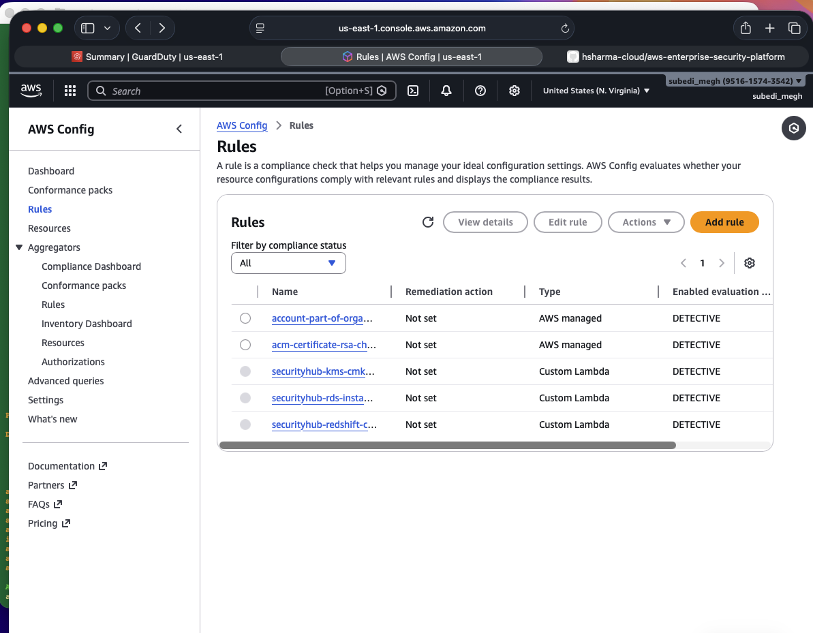
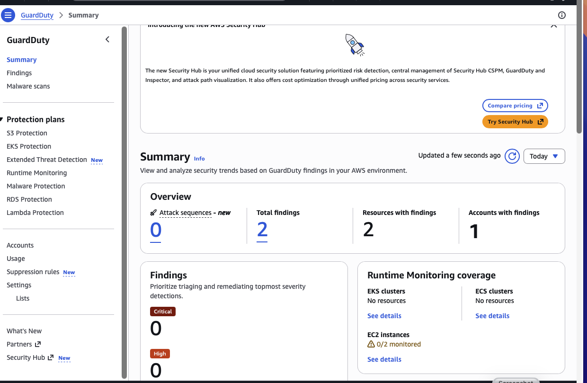
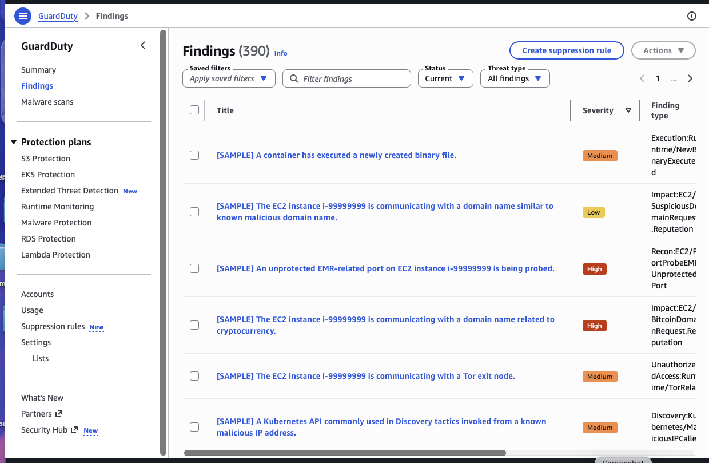
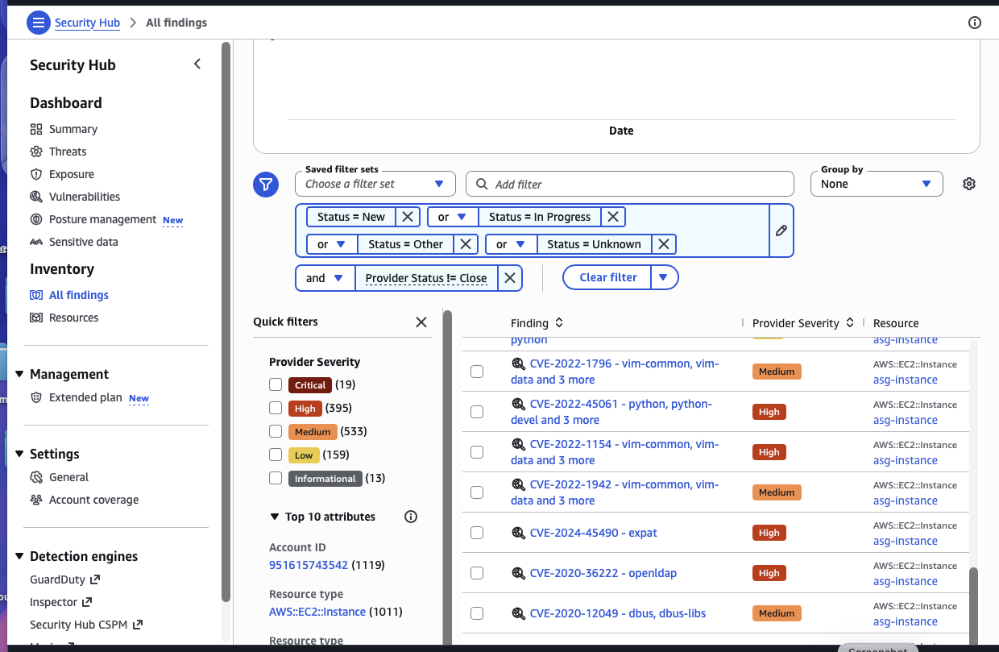
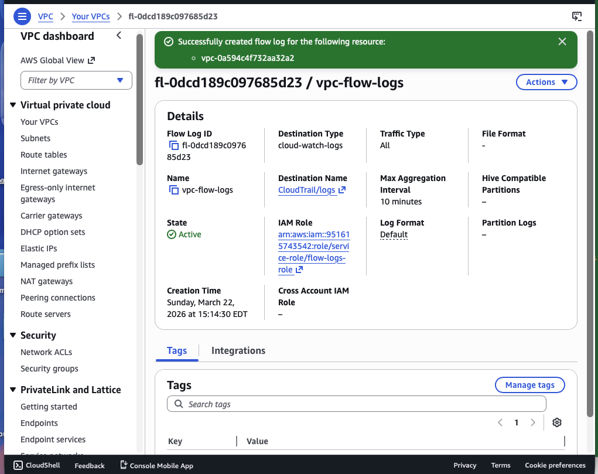
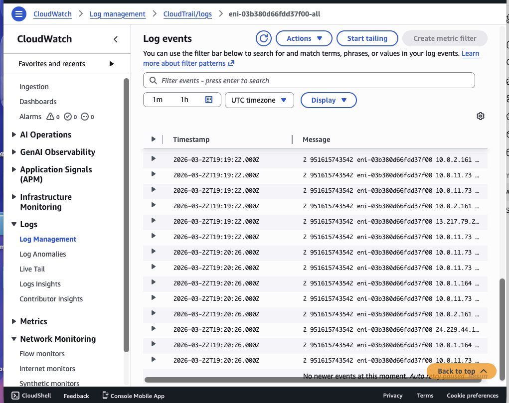

# AWS Security Automation Platform

🚀 Enterprise-grade AWS security monitoring and automated response platform built using native AWS services and Terraform.

## 🏗️ Architecture Diagram

```text
                         Internet
                             │
                             ▼
                    AWS Shield (DDoS)
                             │
                             ▼
              Application Load Balancer (ALB)
                             │
                             ▼
                    EC2 Application Layer
                             │
        ┌────────────────────┼────────────────────┐
        │                    │                    │
        ▼                    ▼                    ▼
 AWS CloudTrail        AWS Inspector        AWS Config
        │                    │                    │
        ▼                    ▼                    ▼
     S3 Logs            Vulnerabilities     Compliance Check
        │                    │                    │
        ▼                    ▼                    ▼
     AWS Macie             (Scan)          Amazon EventBridge
                                                   │
                                                   ▼
                                            AWS Lambda
                                                   │
                                                   ▼
                                      Auto Remediation (SG Fix)
```


## 📌 Overview

This project demonstrates a real-world **cloud security automation platform** built on AWS.

It provides:

- Continuous monitoring of AWS activity  
- Detection of threats and misconfigurations  
- Automated remediation using serverless workflows  
- Centralized visibility across security services  

---

## 🔄 Security Automation Pipeline

### 1️⃣ Logging & Visibility
- AWS CloudTrail captures API activity  
- AWS Config tracks configuration changes  
- Logs stored securely in S3  

### 2️⃣ Threat Detection
- GuardDuty detects malicious activity  
- Security Hub aggregates findings  
- Inspector scans vulnerabilities  
- Macie detects sensitive data  

### 3️⃣ Event-Driven Response
- EventBridge captures security events  
- Lambda performs automated remediation  

### 4️⃣ Protection Layer
- AWS Shield provides DDoS protection  
- AWS WAF protects applications  

---

## ⚡ Automated Remediation Example

### 🚨 Scenario
A security group allows public SSH access (0.0.0.0/0)

### 🔁 Flow
1. AWS Config detects violation  
2. EventBridge triggers event  
3. Lambda removes insecure rule  

### ✅ Result
- Risk automatically removed  
- No manual intervention  
- Continuous compliance  

---

## 🛠️ Technologies Used

- Terraform  
- AWS Lambda  
- Amazon EventBridge  
- AWS CloudTrail  
- AWS Config  
- Amazon GuardDuty  
- AWS Security Hub  
- AWS Inspector  
- AWS Macie  
- AWS WAF & Shield  

---

## 🚀 How to Deploy

### 📋 Prerequisites

- AWS account with appropriate permissions  
- AWS CLI configured (`aws configure`)  
- Terraform installed (v1.x recommended)  

---

### ⚙️ Deployment Steps

```bash
# 1. Clone the repository
git clone https://github.com/hsharma-cloud/aws-security-automation-platform.git

# 2. Navigate to Terraform directory
cd aws-security-automation-platform/terraform

# 3. Initialize Terraform
terraform init

# 4. Review execution plan
terraform plan

# 5. Deploy infrastructure
terraform apply
``` 
---

### 🧪 Validation

After deployment, verify the platform is working correctly:

- ✅ Confirm **CloudTrail logs** are delivered to the S3 bucket  
- ✅ Check **AWS Config rules** are evaluating resources  
- ✅ Validate **GuardDuty findings** are generated  
- ✅ Review **Security Hub dashboard** for aggregated alerts  
- ✅ Ensure **EventBridge rules** are triggering properly  
- ✅ Verify **Lambda function execution** for remediation  

#### 🔥 Test Scenario (Recommended)

1. Create or modify a Security Group to allow:
   - `0.0.0.0/0` on port `22` (SSH)

2. Observe:
   - AWS Config detects non-compliance  
   - EventBridge triggers rule  
   - Lambda function executes  
   - Insecure rule is removed automatically  

3. Confirm:
   - Security group is remediated  
   - Logs are visible in CloudWatch  

---


# 📸 Screenshots (Proof of Implementation)

---

## ☁️ Logging & Compliance (CloudTrail + Config)









---

## 🔍 Threat Detection (GuardDuty + Security Hub)







---

## ⚡ Event-Driven Automation


---

## 🔍 Vulnerability Management (Inspector)


---

## 🔐 Data Protection (Macie)


---

## 🛡️ Network & Application Protection


---

## 🌐 Network Visibility (VPC Flow Logs)




---

## 🔐 Encryption & Secrets Management


---

## ⭐ Key Features

- Automated security remediation  
- Event-driven architecture  
- Centralized security visibility  
- Real AWS service integrations  
- Infrastructure fully built with Terraform  

---

## 🧠 Key Learnings

- Building end-to-end security automation pipelines  
- Integrating AWS-native security services  
- Designing event-driven remediation workflows  
- Managing cloud security at scale  
